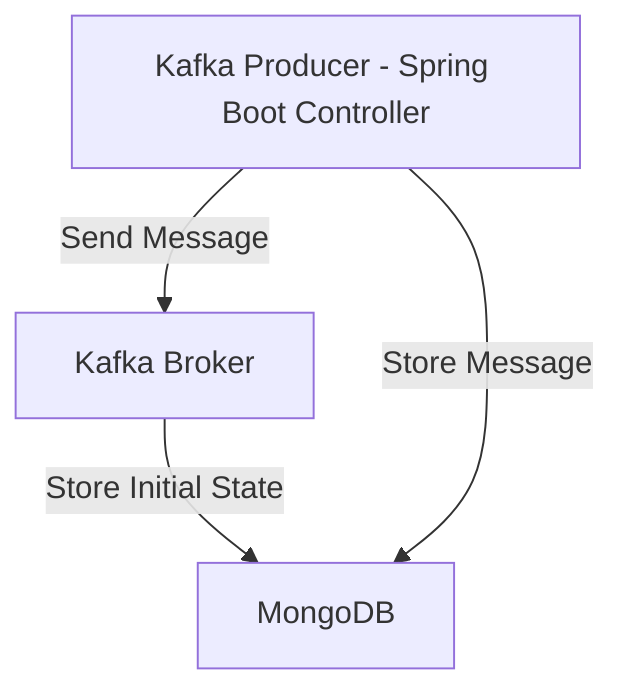

# Proyecto de Kafka con Zookeeper y MongoDB

Este proyecto configura un entorno completo usando Docker Compose para ejecutar Apache Kafka, Zookeeper y MongoDB. 

## Tabla de Contenidos

- [Descripción](#descripción)
- [Requisitos](#requisitos)
- [Ejecución del Proyecto](#ejecución-del-proyecto)
- [Arquitectura](#arquitectura)
- [Comandos Útiles](#comandos-útiles)
- [Integración con Spring Boot](#integración-con-spring-boot)
- [Configurar la Solicitud en Postman](#configurar-la-solicitud-en-postman)  

## Descripción

Este proyecto tiene como objetivo proporcionar un entorno práctico para la gestión y el procesamiento de mensajes utilizando Apache Kafka. Con la ayuda de Docker Compose, se despliegan tres servicios principales:

- **Kafka**: Un sistema de mensajería distribuido que permite la producción y el consumo de mensajes en tiempo real.
- **Zookeeper**: Un servicio de coordinación central que gestiona la configuración y los estados de los brokers de Kafka, asegurando la alta disponibilidad y el manejo eficiente de los nodos.
- **MongoDB**: Una base de datos NoSQL que se utiliza para almacenar de manera persistente los datos generados por los procesos de Kafka.

Este proyecto es ideal para desarrolladores y arquitectos que buscan implementar o probar una arquitectura basada en microservicios donde Kafka actúa como el sistema de mensajería y MongoDB como la capa de persistencia de datos.

## Requisitos
 
Antes de ejecutar este proyecto, asegúrate de tener instalados los siguientes componentes:

- **Docker**: Docker es necesario para ejecutar los contenedores de cada uno de los servicios (Kafka, Zookeeper y MongoDB).
- **Docker Compose**: Docker Compose se utiliza para orquestar y gestionar todos los contenedores definidos en el proyecto.
- **Git**: Es necesario para clonar el repositorio donde se encuentra el código fuente y la configuración del proyecto.
- **Java 21.**
- **Maven instalado para compilar la aplicación Spring Boot.**

## Ejecución del Proyecto

Para ejecutar este proyecto en tu entorno local, sigue los siguientes pasos:

1. **Clonar el repositorio**:

   Clona el repositorio del proyecto en tu máquina local utilizando Git:

   ```bash
   git https://github.com/malbarracin/kafka-producer.git
   cd kafka-producer

2. **Levantar los servicios con Docker Compose**:

   Ejecuta el siguiente comando para levantar los servicios definidos en el archivo docker-compose.yml:

   ```bash
   docker-compose up -d
   ```
   Este comando levantará los servicios de Kafka, Zookeeper, MongoDB y la aplicación Spring Boot. Los servicios estarán disponibles en los siguientes puertos:

    - **Kafka**: localhost:9092
    - **Zookeeper**: localhost:2181
    - **MongoDB**: localhost:27017
    - **Spring Boot**: localhost:8080

2. **Verificar que los contenedores están corriendo**:

    Asegúrate de que los contenedores se han levantado correctamente ejecutando:

    ```bash
    docker ps
    ```
    Deberías ver los contenedores kafka, zookeeper, mongo-dev, y spring-boot-app en estado Up.

## Arquitectura


Descripción del Gráfico

- **A[Kafka Producer - Spring Boot Controller]**: Representa el controlador de Spring Boot que envía mensajes al broker de Kafka y guarda el estado inicial en MongoDB.
- **B[Kafka Broker]**: Es el broker de Kafka, que recibe los mensajes enviados desde el controlador.
- **C[MongoDB]**: La base de datos MongoDB donde se almacena tanto el estado inicial como los mensajes procesados.


## Comandos Útiles

A continuación, se describen algunos comandos útiles que se pueden ejecutar para interactuar con Kafka y MongoDB dentro de este proyecto:

1. **Comandos de Kafka**
    
    **Listar Topics en Kafka:**:
        
    ```bash
    docker-compose exec kafka kafka-topics --bootstrap-server localhost:9092 --list
    ```

    **Explicación**: Este comando lista todos los topics existentes en el broker de Kafka que se está ejecutando en localhost:9092. Un topic es un canal lógico en Kafka donde se publican y consumen mensajes.

    **Crear un Topic en Kafka:**:

    ```bash
    docker-compose exec kafka kafka-topics --bootstrap-server localhost:9092 --create --topic test_topic --partitions 1 --replication-factor 1
    ```

    **Explicación**: Este comando crea un nuevo topic en Kafka llamado test_topic. Se especifica que este topic tendrá 1 partición y un factor de replicación de 1 (sin replicación). Las particiones permiten que un topic se divida en varios fragmentos para aumentar el paralelismo y la escalabilidad.

 2. **Comandos de MongoDB**
    
    **Conectar a MongoDB con Mongo Shell:**:
        
    ```bash
    docker-compose exec mongo-dev mongosh
    ```

    **Explicación**: Este comando te conecta al shell interactivo de MongoDB (mongosh) dentro del contenedor mongo-dev. Desde aquí, puedes ejecutar comandos de MongoDB para administrar bases de datos, colecciones y documentos.

    **Seleccionar la Base de Datos y Autenticarse**:

    ```bash
    use admin
    db.auth( 'mongoadmin', 'secret' )
    ```

    **Explicación**:
       - **use admin**: Cambia a la base de datos admin, que es la base de datos de administración por defecto en MongoDB.
       - **db.auth( 'mongoadmin', 'secret' )**: Autentica al usuario root con la contraseña rot en la base de datos admin. Esto es necesario si la autenticación está habilitada en MongoDB.

## Integración con Spring Boot    

1. El archivo application.yml en la aplicación Spring Boot debe estar configurado para conectar correctamente con Kafka y MongoDB. A continuación se muestra un ejemplo de configuración:

        server:
            port: ${PORT:8080}
                
        spring:
            webflux:
                base-path: /kafka-producer
            kafka:
                bootstrap-servers: localhost:9092
                producer:
                key-serializer: org.apache.kafka.common.serialization.StringSerializer
                value-serializer: org.apache.kafka.common.serialization.StringSerializer
                acks: all
                retries: 3
                enable-idempotence: true
                max-in-flight-requests-per-connection: 5
                transactional-id: "prod-1"    
            data:
                mongodb:
                host: localhost
                port: 27017
                database: kafkaProducerDB
                username: root
                password: root
                authentication-database: admin
                
        ogging:
            level:
                root: info

2. Luego, compila y ejecuta la aplicación:
    -   ``` mvn clean install ```  
    -   ``` mvn spring-boot:run ```       


## Configurar la Solicitud en Postman  
  
   1. Abrir Postman: Abre la aplicación Postman en tu computadora.
   2. Crear una Nueva Solicitud:
        - Haz clic en "New" y selecciona "Request".
        - Asigna un nombre a la solicitud, por ejemplo, "Send Message to SQS".
   3. Configurar la URL de la Solicitud:
        - Selecciona el método POST.
        - Introduce la URL de la solicitud:
        - ``` http://localhost:8080/send ```   
   4. Configurar los Headers:
        - En la pestaña "Headers", añade un nuevo header:
            - Key: Content-Type
            - Value: application/json
   5. Configurar el Body de la Solicitud:
        - En la pestaña "Body", selecciona "raw" y elige "JSON" en el menú desplegable.
        - Introduce el payload JSON que quieres enviar. Por ejemplo: 
             ```json
             {
                 "content": "Este es un mensaje para Kafka"
             }
             ```
   6. Enviar la Solicitud:
        - Haz clic en el botón "Send" para enviar la solicitud a la API Gateway.
   7. Verificar la Respuesta

        ```json
        {
            "id": "66c49df9103ca96a0dc2670f",
            "content": "Este es un mensaje para Kafka",
            "status": "inicial"
        }
        ```        

## ¿Te gusta el contenido que comparto? Invítame un café para ayudarme a seguir creando. ¡Gracias por tu apoyo!
[](https://buymeacoffee.com/malbarracin)        
